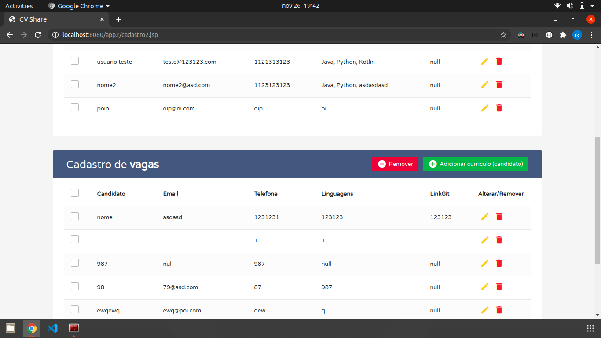

# TimeMachine-Java-JSP

- Pegue seu chapéu e suas ceroulas, bem vindo a cápsula do tempo.
- Você agora está com seu walkman, pesquisando em sua mais nova enciclopédia Barsa.
- Seu pager ao lado do seu bichinho virtual acabou de tocar em seu bolso.
- Que tal desligar seu Mega Drive, colocar um video cassete e se divertir enquanto roda esse projeto?

Nesse momento você acaba de ser transportado para o ano de 1980!

PUF!

Bem vindo!

Telas do projeto em JSP

